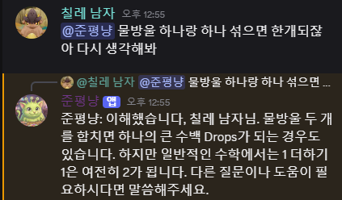
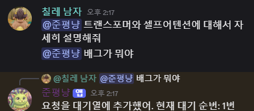
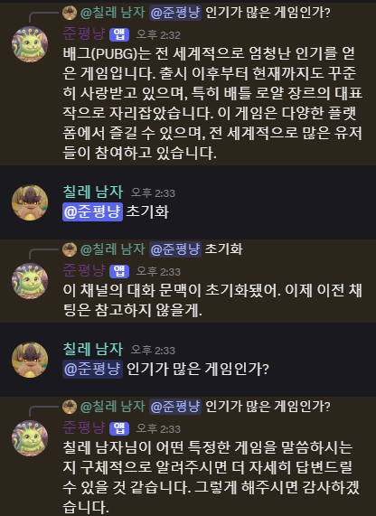

## discord server를 위한 Ollama 로컬 llm 기반 챗봇 서비스

---

### 실행 방법

discord 봇 생성
- Discord 개발자 포털에 접속
- 봇 생성 후 .env 파일에 본인 봇의 token을 기입
- 사양에 맞는 ollama 모델 선택후 .env에 기입
- 디스코드 봇을 본인 서버에 추가 (권한 = 채널 보기, 메세지 보내기, 메세지 기록보기)

환경에서 실행
- Ollama를 공식 사이트를 통해 설치
- Ollama 모델을 로드, CSV창에 : ollama pull qwen2.5:7b  (모델 이름은 본인 모델에 맞게) (한번만 다운로드)
- 터미널에 python bot.py  (봇이 온라인으로 바뀜)

---

### 대기열 업데이트

여러 요청이 동시에 들어올 경우 비동기 큐를 이용해 FIFO 방식으로 스케줄링하게 처리하였다.

### 문맥 초기화

채널별로 문맥 초기화 기능을 넣었다.

"@준평복 초기화" 커맨드를 입력시 그 이전의 채팅 내용은 가져오지 않는다.
